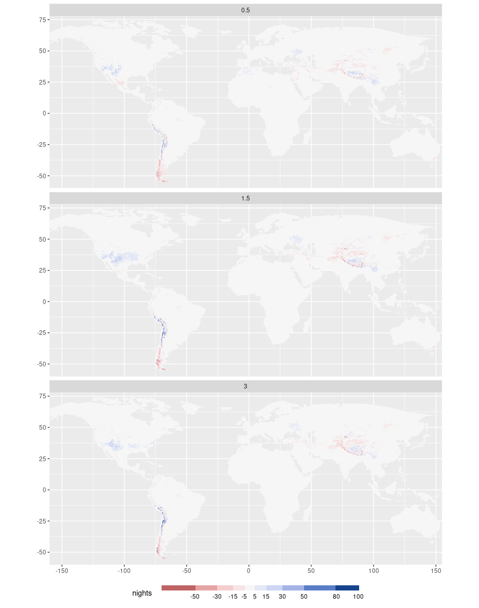

Comparisons: Heat
================
Carlos Dobler -
2023-02-06

## Days above 32C

## Days above 35C

## Days above 38C

## Ten hottests days

## Average daytime temperature

## Freezing days

## Nights above 20C

## Nights above 25C

## Average nighttime temperature

## Frost nights

## Days above 26C wetbulb

## Days above 28C wetbulb

## Days above 30C wetbulb

## Days above 32C wetbulb

## Ten hottest wetbulb days

## Average temperature

