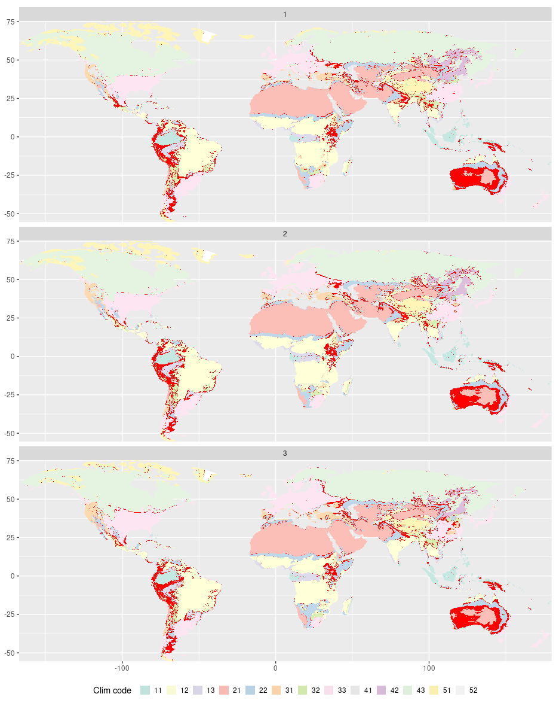

Comparisons: Land
================
Carlos Dobler -
2023-03-20

## Change in water balance

## Probability of year-plus drought

## Probability of year-plus extreme drought

## Change in wildfire danger days

## Climate zones

(different classes colored in red)

