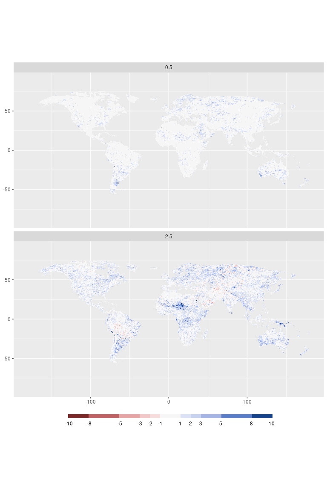

Comparisons: Water
================
Carlos Dobler -
2023-01-20

## Change in total annual precip

## Change in wettest 90 days

## Change in snowy days

## Change in dry hot days

## Change in precipitation of 100 yr storm

## Change in frequency of 100 yr storm

