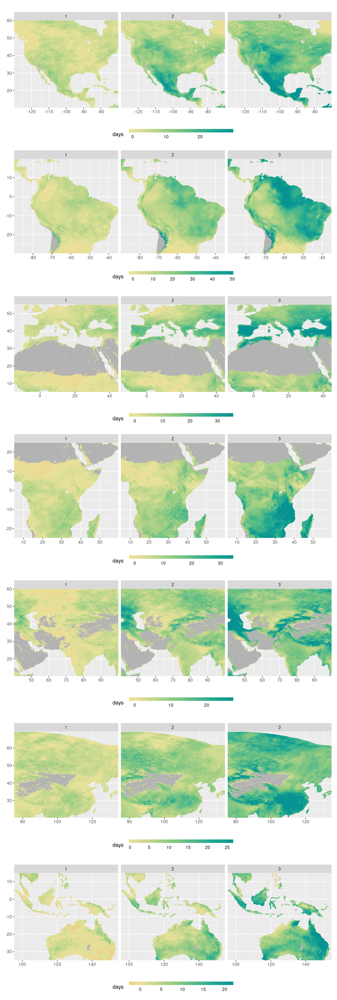

Land module exhibits
================
Carlos Dobler -
2023-02-13

## Change in water balance

## Likelihood of year-plus drought

## Likelihood year-plus extreme drought

## Change in wildfire days

