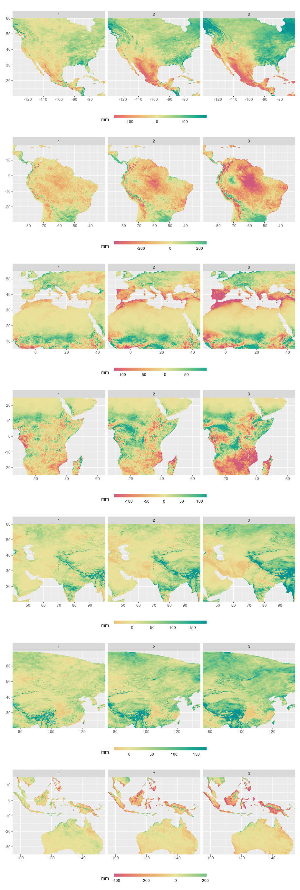
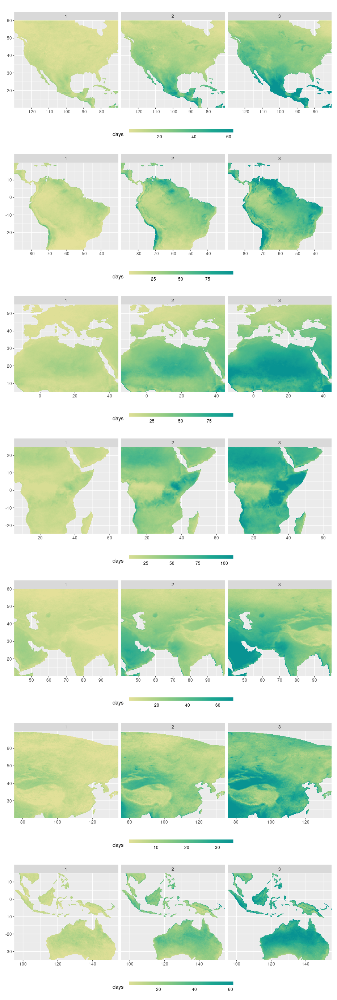

Precipitation exhibits
================
Carlos Dobler -
2022-11-15

## Change in total annual precip

## Change in wettest 90 days

## Change in snowy days

## Change in dry hot days

## Change in precip. 100 yr storm

## Change in frequency 100 yr storm

